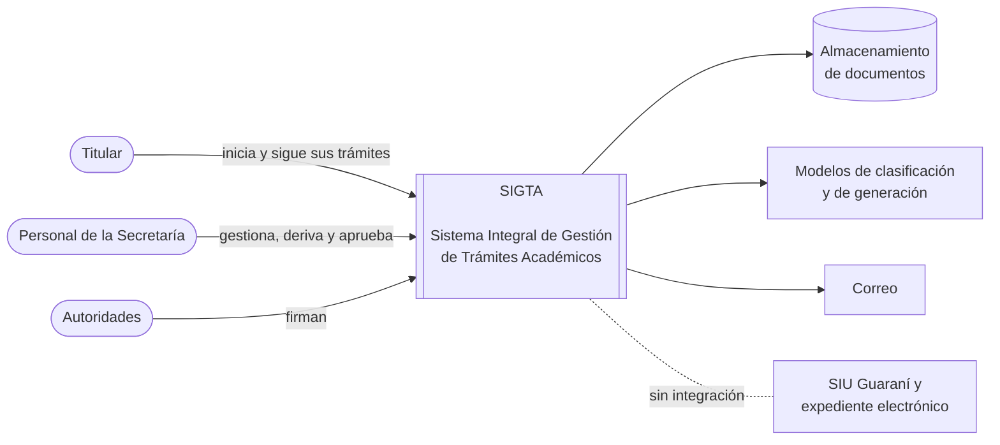
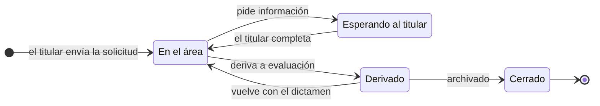
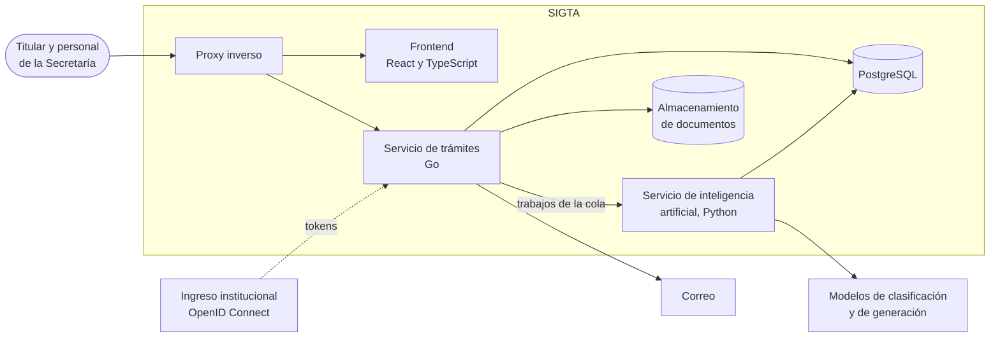
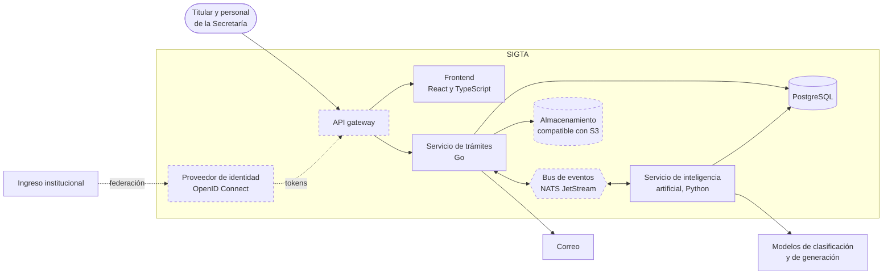
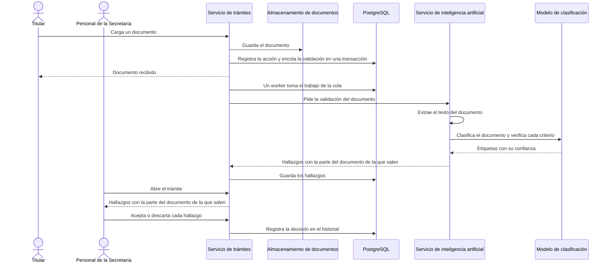

# SIGTA

**Sistema Integral de Gestión de Trámites Académicos**

Plataforma web para iniciar, gestionar y seguir los trámites de la Secretaría de Gestión Académica de la FIUBA, con componentes de inteligencia artificial que asisten al titular y al personal sin tomar decisiones.

Trabajo Profesional de Ingeniería en Informática, Facultad de Ingeniería de la Universidad de Buenos Aires.

[Resumen](#resumen) | [Modelo de dominio](#modelo-de-dominio) | [Arquitectura](#arquitectura) | [Inteligencia artificial](#inteligencia-artificial) | [Decisiones de diseño](#decisiones-de-diseño) | [Decisiones abiertas](#decisiones-abiertas) | [Contribuir](CONTRIBUTING.md)

> [!NOTE]
> SIGTA es un trabajo académico en etapa de diseño: este repositorio todavía no tiene código. No es un sistema oficial de la FIUBA ni está en uso.

**Abstract.** SIGTA (Integrated Academic Procedures Management System) is a web platform for starting, managing and tracking the administrative procedures of the Academic Affairs Office of the School of Engineering, University of Buenos Aires (FIUBA). It adds three artificial intelligence components with bounded autonomy: an assistant that answers applicants' questions with cited sources, assisted validation of submitted documents, and generation of draft records. None of them makes decisions on a procedure. The technical contribution is the design and experimental evaluation of these components against predefined test sets that include ambiguous, contradictory and malicious documents. SIGTA is a Computer Engineering capstone project at FIUBA.

## Resumen

Hoy cada trámite académico combina varios canales y no hay un registro único de su estado. SIGTA reúne en un solo lugar la solicitud, la documentación, el estado y el historial de cada trámite. Tiene dos interfaces: el titular inicia la solicitud, carga la documentación y consulta el estado; el personal de la Secretaría tiene una bandeja con los trámites que esperan su intervención.

Sobre esa base se agregan tres componentes de inteligencia artificial, en este orden de prioridad: un asistente que responde consultas de los titulares, la validación asistida de la documentación y la generación de borradores de actas. Ninguno toma decisiones sobre un trámite.

**Contribución técnica.** El trabajo diseña y evalúa experimentalmente esos componentes. Para cada uno se define qué resuelve el código de forma determinística y qué se delega a un modelo, y su calidad se mide con conjuntos de evaluación que incluyen documentos ambiguos, contradictorios y maliciosos.

## Alcance

| Trámites cubiertos |
| --- |
| Equivalencia entre asignaturas |
| Reconocimiento de créditos |
| Intercambios académicos |
| Pase de universidad extranjera |
| Pase de universidad dentro de la UBA |

Cada tipo de trámite se define como configuración versionada; incorporar uno nuevo no requiere cambios en el motor.

- Toda decisión sobre un trámite la toma una persona; los componentes de inteligencia artificial solo proponen.
- Todos los entornos usan datos sintéticos o anonimizados.
- SIGTA no se integra con SIU Guaraní ni con el expediente electrónico: lo que ocurre allí lo registra el personal de la Secretaría.
- SIGTA no implementa firma digital con validez legal ni resuelve el dictamen académico de un trámite.
- Todo el sistema es autoalojable, sin depender de una nube en particular. Usar un modelo por API externa depende del tratamiento de los datos personales.

## Modelo de dominio

Cada operación sobre un trámite es una acción que un actor ejecuta sobre un paso, y queda registrada en el historial del trámite. El modelo es el mismo para los cinco trámites: lo que cambia entre uno y otro es su configuración.

| Acción | Qué registra | Efecto |
| --- | --- | --- |
| Cargar dato | Un valor tipado: texto, número, fecha u opción | Completa una entrada del paso |
| Cargar documento | Un documento asociado al requisito que cubre | Queda disponible para la validación asistida |
| Confirmar hecho externo | Algo ocurrido fuera de SIGTA, con quién lo declaró y cuándo | Abre o cierra un paso externo, como una derivación |
| Decidir | La salida elegida para cerrar el paso | Continuar, devolver, pedir información al titular, derivar o aprobar |

Los actores son el titular, el personal de la Secretaría (por área y perfil), las autoridades que firman y los evaluadores externos, como las comisiones curriculares, cuyos pasos registra el personal de la Secretaría. El estado de un trámite se calcula a partir de su paso abierto:

## Arquitectura

SIGTA se entrega como un monolito modular en Go con un único servicio aparte, el de inteligencia artificial en Python, que se separa por el lenguaje y por su ciclo de evaluación. Todo lo demás vive en PostgreSQL. Cada componente adicional tiene un disparador explícito y se suma solo cuando se cumple.

### Arquitectura para la defensa

| Componente | Responsabilidad | Tecnología |
| --- | --- | --- |
| Proxy inverso | HTTPS, ruteo al frontend y a la API, límites de uso | El de la infraestructura de destino; nginx en desarrollo |
| Frontend | Interfaz del titular y bandeja de la Secretaría, con un cliente tipado generado desde OpenAPI | React, TypeScript, Vite |
| Servicio de trámites | Dominio, motor de pasos, permisos, historial, cola de trabajos y avisos por correo; única API pública | Go |
| Servicio de inteligencia artificial | Asistente, validación asistida y borradores de actas, con su base de conocimiento y sus evaluaciones | Python |
| Base de datos | Estado e historial de los trámites, cola de trabajos, búsqueda de texto completo y vectores | PostgreSQL con pgvector |
| Almacenamiento de documentos | Documentos de los trámites, que se descargan siempre a través del servicio de trámites | Sistema de archivos detrás de un puerto |
| Modelos | Clasificación y generación de texto | Reglas en código, Laya, Claude u otro modelo, detrás de puertos |

### Evolución

Cada componente de esta tabla queda fuera de la defensa salvo que se cumpla su disparador. Como todos están detrás de un puerto, sumarlos cambia un adaptador y no el dominio.

| Componente | Se suma cuando | Hasta entonces |
| --- | --- | --- |
| Bus de eventos (NATS JetStream) | La cola en PostgreSQL no sostiene la carga medida, o un segundo servicio necesita consumir los mismos eventos | Cola de trabajos en PostgreSQL |
| Almacenamiento compatible con S3 | La infraestructura de destino ofrece almacenamiento de objetos | Sistema de archivos |
| Proveedor de identidad propio (Keycloak o Zitadel) | La Subsecretaría de TICs no habilita el ingreso institucional para SIGTA | Ingreso institucional, y enlace por correo para titulares sin cuenta institucional |
| Observabilidad completa (OpenTelemetry, Prometheus, Grafana) | El sistema pasa a operar en la infraestructura de destino | Logs estructurados y registro de cada llamada a un modelo |
| API gateway | Hay más de un servicio expuesto al público | El proxy inverso |

### Arquitectura objetivo

Con todos los disparadores cumplidos, los componentes nuevos (con borde punteado) se suman así:

### Datos y comunicación

- **Historial de acciones.** Cada acción sobre un trámite se guarda en una tabla que solo crece, en la misma transacción que actualiza su estado. El historial alcanza para auditar sin reconstruir el estado a partir de eventos.
- **Cola de trabajos en PostgreSQL.** El trabajo asincrónico (validaciones, avisos por correo, recordatorios) se encola en la misma transacción que el cambio que lo origina, así ningún trabajo se pierde ni se encola sin que el cambio haya ocurrido. Un worker del servicio de trámites toma cada trabajo con `FOR UPDATE SKIP LOCKED`. Un trabajo puede ejecutarse más de una vez, así que cada uno es idempotente.
- **Cada servicio es dueño de sus datos.** Los dos servicios comparten la instancia de PostgreSQL, no los esquemas: el de trámites es dueño de los trámites, el historial y la cola; el de inteligencia artificial, de la base de conocimiento y sus vectores. Ninguno lee las tablas del otro.
- **Contrato primero.** La API pública y la API interna del servicio de inteligencia artificial se describen con OpenAPI, y el código de los dos lados se genera desde esa especificación.

### Autenticación y autorización

- **OpenID Connect.** El inicio de sesión se delega en el ingreso institucional, si la Subsecretaría de TICs lo habilita para SIGTA. Los titulares sin cuenta institucional, como los de un pase desde otra universidad, ingresan con un enlace de un solo uso enviado por correo.
- **El servicio de trámites valida el token** en cada pedido y autoriza según rol, área y perfil, que se administran en SIGTA: el titular ve solo sus trámites; el personal trabaja según su área y su perfil (operativo o de aprobación); las autoridades firman. Los intentos sin permiso quedan registrados.
- **Documentos con acceso controlado:** se descargan a través del servicio de trámites, que verifica el permiso sobre el trámite en cada descarga.

### Diseño interno de cada servicio

Cada servicio sigue una arquitectura de **puertos y adaptadores**. El núcleo contiene el dominio y los casos de uso, y define como interfaces todo lo que necesita del exterior. Los adaptadores dependen del núcleo y nunca al revés: un adaptador puede ser otro servicio, un modelo local o reglas escritas en código, y para el núcleo es indistinto. El diagrama corresponde al servicio de trámites.

```mermaid
flowchart LR
    subgraph AE["Adaptadores de entrada"]
        direction TB
        REST["API REST<br/>contrato OpenAPI"]
        WRK["Trabajos de la cola"]
        JOBS["Tareas programadas"]
    end

    subgraph NUC["Núcleo"]
        direction LR
        PE["Casos de uso"] --> DOM{{"Dominio y<br/>motor de pasos"}} --> PS["Puertos de salida"]
    end

    subgraph AS["Adaptadores de salida"]
        direction TB
        DEF["Configuración de trámites"]
        DB["PostgreSQL"]
        Q["Cola de trabajos"]
        DOC["Almacenamiento de documentos"]
        AIS["Servicio de inteligencia artificial"]
        ID["Identidad"]
        MAIL["Correo"]
    end

    AE --> NUC
    NUC -->|a través de los puertos| AS
```

| Puerto de salida | Adaptadores | Estado |
| --- | --- | --- |
| Definiciones de trámites | Archivos de configuración versionados; a futuro, un editor dentro de la aplicación | Elegido |
| Persistencia y búsqueda | PostgreSQL con texto completo | Elegido |
| Cola de trabajos | Tabla en PostgreSQL; NATS JetStream si se cumple su disparador | Elegido |
| Documentos | Sistema de archivos; almacenamiento compatible con S3 si la infraestructura lo ofrece | Elegido |
| Inteligencia artificial | El servicio de inteligencia artificial, a través de su API interna | Elegido |
| Identidad | Ingreso institucional por OpenID Connect y enlace por correo; un proveedor propio si no se habilita el ingreso institucional | A acordar con la Subsecretaría de TICs |
| Correo | El servidor de correo de la infraestructura de destino | Propuesto |

El servicio de inteligencia artificial sigue la misma estructura. Sus puertos de salida son la clasificación y la generación de texto, con adaptadores para reglas en código, modelos de pesos abiertos como Laya y modelos por API como Claude; los conjuntos de evaluación son uno más de sus adaptadores de entrada.

Las pruebas del dominio usan adaptadores en memoria, sin base de datos ni servicios externos. Las de cada adaptador corren contra la dependencia real en un contenedor, para que los dos no diverjan.

### Despliegue

- Todos los componentes corren en contenedores, autoalojables y sin depender de una nube en particular. En desarrollo, el sistema completo se levanta con Docker Compose.
- La integración continua corre en GitHub Actions. Hoy valida el título de cada pull request; con el código suma lint, pruebas y escenarios Gherkin en cada pull request, y la construcción de imágenes al integrar en `main`.
- Los conjuntos de evaluación no corren en cada pull request, porque los modelos reales tienen costo y los runners no tienen GPU. En el pull request se usan adaptadores deterministas, y la evaluación completa corre en forma programada o a pedido.
- Si la red de destino no acepta conexiones entrantes, el servidor baja las imágenes nuevas por su cuenta.

## Inteligencia artificial

| Componente | Resuelve el código | Delega a un modelo | Límite |
| --- | --- | --- | --- |
| Asistente para titulares | Recupera fragmentos de la base de conocimiento validada por la Secretaría y descarta respuestas sin fuente | Redacta la respuesta a partir de esos fragmentos, citándolos | No informa el estado de un trámite; fuera de la base indica a quién consultar |
| Validación asistida | Toma los requisitos y criterios de la configuración del trámite | Clasifica cada documento y verifica cada criterio | No aprueba, no rechaza ni cambia el estado del trámite |
| Borradores de actas | Completa la plantilla con los datos del trámite | Sugiere texto libre, si la plantilla lo tiene (en definición) | Siempre es un borrador; no interpreta el dictamen |

Recorrido de punta a punta de la validación asistida: el procesamiento es asincrónico y la decisión final es de una persona.

Cada componente tiene un conjunto de evaluación propio, con documentos ambiguos, contradictorios y maliciosos y casos de inyección de instrucciones. Las respuestas esperadas las etiqueta alguien ajeno al equipo, para que la evaluación no mida contra lo que el mismo equipo fabricó. Se mide la proporción de respuestas con fuente citada y de consultas fuera de cobertura bien derivadas, los hallazgos correctos y los omitidos por requisito, y los borradores aprobados sin corregir campos estructurados. En operación, la aceptación o el descarte de cada hallazgo por parte del personal queda registrado y amplía el conjunto. Los umbrales se fijan después de medir la línea de base.

Cada llamada a un modelo registra costo, latencia y versión del prompt desde el inicio. Como los puertos admiten adaptadores distintos, la misma evaluación compara reglas, modelos de pesos abiertos y modelos por API en calidad, latencia y costo.

## Stack tecnológico

| Capa | Tecnología |
| --- | --- |
| Lenguajes | Go (servicio de trámites), Python (servicio de inteligencia artificial), TypeScript (frontend) |
| Contratos | OpenAPI, con código generado para el servidor y los clientes |
| Frontend | React, Vite, TanStack Query, React Router |
| Datos | PostgreSQL con pgvector |
| Trabajo asincrónico | Cola de trabajos en PostgreSQL |
| Documentos | Sistema de archivos detrás de un puerto |
| Identidad | OpenID Connect contra el ingreso institucional |
| Entrada | Proxy inverso de la infraestructura de destino; nginx en desarrollo |
| Modelos | Reglas en código, Laya, Claude u otro modelo, local o por API, detrás de puertos |
| Pruebas | go test, pytest, Vitest, Playwright; escenarios Gherkin como criterios de aceptación, automatizados con godog en las reglas del motor |
| Observabilidad | Logs estructurados y registro de cada llamada a un modelo |
| Infraestructura | Contenedores, Docker Compose |
| Integración continua | GitHub Actions |

### Alternativas descartadas

Los criterios son los del anteproyecto: costo para la institución, integración con GitHub Actions y mantenimiento posterior.

| Alternativa | Por qué no |
| --- | --- |
| Java con Spring Boot | Más memoria por proceso y más framework que operar en un servidor compartido; Go compila a un binario único y liviano |
| Python en todo el backend | El dominio y el motor de pasos ganan con tipado estático; Python queda donde están sus librerías, en el servicio de inteligencia artificial |
| Next.js | El renderizado en servidor no aporta en una aplicación detrás de inicio de sesión, y suma un servidor Node.js que operar |
| Event sourcing con proyecciones | Exige versionar eventos con un dominio que todavía cambia, y complica la rectificación y la supresión de datos personales sobre eventos inmutables |
| NATS JetStream, RabbitMQ o Kafka desde el inicio | Otro servicio con estado que operar y respaldar para una carga que PostgreSQL sostiene; NATS queda como evolución con disparador |
| Base vectorial aparte (Qdrant, Weaviate) o MongoDB | Una base más que operar y respaldar; pgvector cubre los vectores y el dominio es relacional |
| AsyncAPI con código generado | Los generadores para Go todavía son inmaduros, y con una cola interna alcanza con OpenAPI |
| MinIO | En 2025 la edición comunitaria perdió la consola de administración y dejó de publicar imágenes, y en 2026 el repositorio quedó archivado |
| Amazon S3 u otra nube | Costo en dólares y documentos con datos personales fuera de la institución |
| Keycloak o Zitadel desde el inicio | Es lo más pesado de operar para la Subsecretaría de TICs; queda como evolución si no se habilita el ingreso institucional |
| Usuarios y contraseñas propios | Guardar credenciales es un riesgo evitable, y el personal ya tiene cuenta institucional |
| API gateway (Traefik, KrakenD, Kong) | Con una sola API pública no agrega nada que no haga el proxy inverso |
| Kubernetes | Sobra para un solo servidor, y no se sabe si la infraestructura de destino lo ofrece |
| Prometheus y Grafana desde el inicio | Tres servicios más sin usuarios ni carga que observar |
| GitLab CI o Jenkins | El repositorio está en GitHub, y GitHub Actions no tiene costo para repositorios públicos |

## Decisiones de diseño

- **Puertos y adaptadores:** el almacenamiento, los modelos, la identidad y el lugar de despliegue pueden cambiar; el dominio no tiene que enterarse.
- **Trámites como configuración versionada:** los cinco trámites comparten estructura, y un editor de flujos para personal no técnico sería un producto aparte. Sumar un trámite es un cambio de configuración por pull request.
- **La inteligencia artificial propone y una persona decide:** un error en un trámite afecta la situación académica de alguien.
- **Los sistemas institucionales se registran, no se integran:** el personal confirma en SIGTA lo que hace en SIU Guaraní o en el expediente electrónico, y queda registrado quién lo declaró.
- **El resultado de un trámite se comunica sin interpretarlo:** un reconocimiento total, uno parcial y un rechazo son el mismo evento, un dictamen que se adjunta y se comunica.
- **Monolito modular y un solo servicio aparte:** el de inteligencia artificial se separa desde el inicio porque usa otro lenguaje y tiene su propio ciclo de evaluación. Cualquier otra separación espera a que se cumpla su disparador.
- **Historial de acciones sin event sourcing:** un trámite se audita, no solo se consulta. El historial se escribe en la misma transacción que el estado, y eso alcanza para auditar.
- **Cola en PostgreSQL:** encolar en la misma transacción que el cambio garantiza que ningún trabajo se pierda, sin otro servicio que operar.
- **Una sola base relacional:** PostgreSQL con pgvector cubre estado, historial, cola, búsqueda de texto en español y vectores.
- **Contrato primero:** el frontend, el servicio de trámites y el de inteligencia artificial están en lenguajes distintos; OpenAPI genera el código de cada lado para que no se desfasen.
- **Autoalojable:** el sistema puede terminar en la infraestructura de la UBA, y los documentos contienen datos personales que conviene que no salgan de la institución. Usar un modelo por API externa depende de cómo se resuelva el tratamiento de esos datos.

## Decisiones abiertas

| Tema | Qué falta definir | Depende de |
| --- | --- | --- |
| Dónde corren los modelos | Si la infraestructura de destino tiene GPU para un modelo de pesos abiertos, o si se usa un modelo por API y con qué datos | Subsecretaría de TICs y datos personales |
| Datos personales | Base legal y finalidad, inscripción de la base, retención de cada documento, cómo se ejercen la rectificación y la supresión, y si un documento puede salir de la institución hacia un modelo por API (Ley 25.326) | Secretaría y área legal de la facultad |
| Etiquetado de la evaluación | Quién ajeno al equipo etiqueta las respuestas esperadas, cuántos casos y cómo se mide el acuerdo entre etiquetadores | Equipo y Secretaría |
| Extracción de texto | Cómo se extrae el texto de un documento escaneado antes de clasificarlo | Pruebas con documentos de ejemplo |
| Documentos cargados | Tamaño y tipos admitidos, y análisis de malware | Equipo |
| Integridad del historial | Si alcanzan los permisos de la base o hace falta encadenar hashes para que una modificación quede en evidencia | Equipo |
| Cambios de configuración | Qué pasa con un trámite en curso cuando cambia la versión de su configuración | Equipo |
| Desistimiento y vencimiento | Cómo se cierra un trámite si el titular desiste o no responde a tiempo | Secretaría |
| Respaldo | Cuántos datos se pueden perder y en cuánto tiempo se recupera el servicio, con simulacros de restauración | Subsecretaría de TICs |
| Accesibilidad | Qué nivel de las pautas WCAG se cumple (Ley 26.653) y cómo se verifica en la integración continua | Equipo |
| Hosting, costo e identidad | Infraestructura de destino, costo mensual estimado e ingreso institucional | Subsecretaría de TICs |
| Operación posterior | Quién opera el sistema y mantiene la base de conocimiento del asistente cuando termine el proyecto | Secretaría y Subsecretaría de TICs |

## Estado del proyecto

| Etapa | Período | Estado |
| --- | --- | --- |
| Definición y relevamiento | Septiembre de 2026 | Completa |
| Desarrollo | Octubre de 2026 a mayo de 2027 | En curso |
| Defensa | Junio y julio de 2027 | A confirmar |

## Contribuir

La forma de trabajo, las convenciones y el flujo de pull requests están en [CONTRIBUTING.md](CONTRIBUTING.md).

## Equipo

- Francisco López Tancredi ([@flopeztancredi](https://github.com/flopeztancredi))
- Ezequiel Pérez Adamo ([@echepereza](https://github.com/echepereza))
- Aizen Sánchez Acero ([@AizenSanchez](https://github.com/AizenSanchez))
- Santino Zucconi ([@SantinoZucconi](https://github.com/SantinoZucconi))

**Dirección:** Marcos Arturo Saladino y Mauro Lucas Ciancio Alessio.

## Licencia

[MIT](LICENSE)
