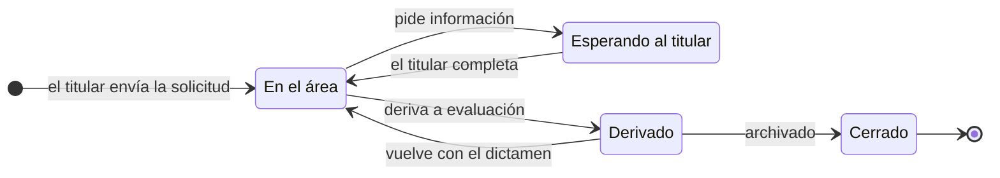
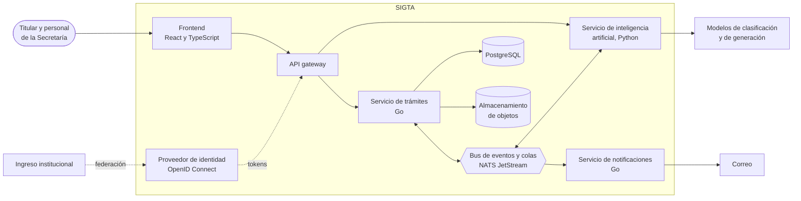
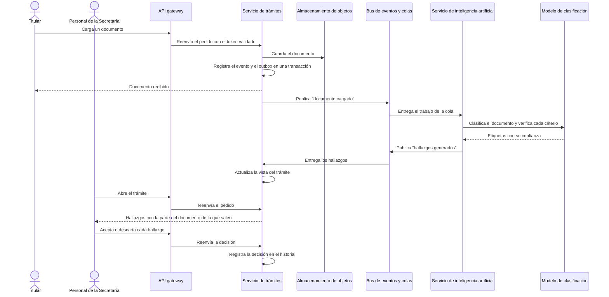

# SIGTA

**Sistema Integral de Gestión de Trámites Académicos**

Plataforma web para iniciar, gestionar y seguir los trámites de la Secretaría de Gestión Académica de la FIUBA, con componentes de inteligencia artificial que asisten al titular y al personal sin tomar decisiones.

Trabajo Profesional de Ingeniería en Informática, Facultad de Ingeniería de la Universidad de Buenos Aires.

[Resumen](#resumen) | [Modelo de dominio](#modelo-de-dominio) | [Arquitectura](#arquitectura) | [Inteligencia artificial](#inteligencia-artificial) | [Decisiones de diseño](#decisiones-de-diseño) | [Contribuir](CONTRIBUTING.md)

> [!NOTE]
> SIGTA es un trabajo académico en etapa de diseño: este repositorio todavía no tiene código. No es un sistema oficial de la FIUBA ni está en uso.

**Abstract.** SIGTA (Integrated Academic Procedures Management System) is a web platform for starting, managing and tracking the administrative procedures of the Academic Affairs Office of the School of Engineering, University of Buenos Aires (FIUBA). It adds three artificial intelligence components with bounded autonomy: an assistant that answers applicants' questions with cited sources, assisted validation of submitted documents, and generation of draft records. None of them makes decisions on a procedure. The technical contribution is the design and experimental evaluation of these components against predefined test sets that include ambiguous, contradictory and malicious documents. SIGTA is a Computer Engineering capstone project at FIUBA.

## Resumen

Hoy cada trámite académico combina varios canales y no hay un registro único de su estado. SIGTA reúne en un solo lugar la solicitud, la documentación, el estado y el historial de cada trámite. Tiene dos interfaces: el titular inicia la solicitud, carga la documentación y consulta el estado; el personal de la Secretaría tiene una bandeja con los trámites que esperan su intervención.

Sobre esa base se agregan tres componentes de inteligencia artificial, en este orden de prioridad: un asistente que responde consultas de los titulares, la validación asistida de la documentación y la generación de borradores de actas. Ninguno toma decisiones sobre un trámite.

**Contribución técnica.** El trabajo diseña y evalúa experimentalmente esos componentes. Para cada uno se define qué resuelve el código de forma determinística y qué se delega a un modelo, y su calidad se mide con conjuntos de evaluación que incluyen documentos ambiguos, contradictorios y maliciosos.

## Alcance

| Trámites cubiertos |
| --- |
| Equivalencia entre asignaturas |
| Reconocimiento de créditos |
| Intercambios académicos |
| Pase de universidad extranjera |
| Pase de universidad dentro de la UBA |

Cada tipo de trámite se define como configuración versionada; incorporar uno nuevo no requiere cambios en el motor.

- Toda decisión sobre un trámite la toma una persona; los componentes de inteligencia artificial solo proponen.
- Todos los entornos usan datos sintéticos o anonimizados.
- SIGTA no se integra con SIU Guaraní ni con el expediente electrónico: lo que ocurre allí lo registra el personal de la Secretaría.
- SIGTA no implementa firma digital con validez legal ni resuelve el dictamen académico de un trámite.
- Todo el sistema es autoalojable, sin depender de una nube en particular.

## Modelo de dominio

Cada operación sobre un trámite es una acción que un actor ejecuta sobre un paso, y se registra como un evento en el historial. El modelo es el mismo para los cinco trámites: lo que cambia entre uno y otro es su configuración.

| Acción | Qué registra | Efecto |
| --- | --- | --- |
| Cargar dato | Un valor tipado: texto, número, fecha u opción | Completa una entrada del paso |
| Cargar documento | Un documento asociado al requisito que cubre | Queda disponible para la validación asistida |
| Confirmar hecho externo | Algo ocurrido fuera de SIGTA, con quién lo declaró y cuándo | Abre o cierra un paso externo, como una derivación |
| Decidir | La salida elegida para cerrar el paso | Continuar, devolver, pedir información al titular, derivar o aprobar |

Los actores son el titular, el personal de la Secretaría (por área y perfil), las autoridades que firman y los evaluadores externos, como las comisiones curriculares, cuyos pasos registra el personal de la Secretaría. El estado de un trámite se calcula a partir de su paso abierto:

## Arquitectura

La arquitectura objetivo es un conjunto chico de servicios autoalojables que se comunican por eventos, detrás de un único punto de entrada. El sistema arranca como un monolito modular en Go y cada servicio se separa cuando hay un motivo concreto (lenguaje, carga, aislamiento o ciclo de despliegue), sin cambiar el dominio.

| Componente | Responsabilidad | Tecnología candidata | Etapa |
| --- | --- | --- | --- |
| API gateway | Único punto de entrada: HTTPS, validación de tokens, límites de uso y ruteo a los servicios | Traefik, KrakenD o el proxy de la infraestructura de destino | 2 |
| Frontend | Interfaz del titular y bandeja de la Secretaría, con un cliente tipado generado desde OpenAPI | React, TypeScript, Vite | 1 |
| Servicio de trámites | Dominio, motor de pasos, permisos e historial; dueño de los datos de los trámites | Go | 1 |
| Servicio de inteligencia artificial | Asistente, validación asistida y borradores de actas; recuperación y evaluación | Python | 2 |
| Servicio de notificaciones | Avisos por correo a partir de eventos | Go | 2 |
| Proveedor de identidad | Inicio de sesión, usuarios, roles y federación con el ingreso institucional | Keycloak, Zitadel o el proveedor institucional | 2 |
| Bus de eventos y colas | Eventos entre servicios y colas de trabajo (validaciones, avisos y tareas pendientes), con entrega garantizada | NATS JetStream | 2 |
| Base de datos | Eventos de cada trámite, proyecciones de lectura, búsqueda de texto completo y vectores | PostgreSQL con pgvector | 1 |
| Almacenamiento de objetos | Documentos de los trámites | Compatible con S3, autoalojado o en la nube | 1 |
| Modelos | Clasificación y generación de texto | Laya, Claude u otro modelo, local o por API | 1 |
| Observabilidad | Trazas, métricas y logs de punta a punta, incluido el costo y la latencia de cada llamada a un modelo | OpenTelemetry, Prometheus, Grafana | 3 |

### Evolución

| Etapa | Qué incluye | Por qué en ese orden |
| --- | --- | --- |
| 1. Monolito modular | Servicio de trámites en Go con puertos y adaptadores, frontend, PostgreSQL, almacenamiento de objetos y los modelos detrás de puertos | El dominio es lo que más tiene que estabilizarse; separar antes multiplica el costo de cada cambio |
| 2. Servicios | Inteligencia artificial en Python, notificaciones, bus de eventos, gateway y proveedor de identidad | Los componentes de inteligencia artificial tienen otro lenguaje, otra carga y otro ciclo de evaluación |
| 3. Operación | Observabilidad completa, despliegue automático en la infraestructura de destino y endurecimiento | Hace falta para validar con la Secretaría y sostener el sistema después del proyecto |

### Datos y comunicación

- **Historial como fuente de verdad.** Cada trámite es una secuencia de eventos que no se modifica (event sourcing). El estado y las bandejas son proyecciones que se recalculan a partir de esos eventos, así la trazabilidad no es una tabla aparte sino el modelo mismo.
- **Eventos entre servicios con outbox.** El servicio de trámites guarda el cambio y el evento a publicar en la misma transacción, y un proceso aparte los publica en el bus. Ningún evento se pierde ni se publica sin que el cambio haya ocurrido.
- **Contrato primero.** La API pública se describe con OpenAPI y los eventos con AsyncAPI; el código de los dos lados se genera desde esas especificaciones.

### Autenticación y autorización

- **OpenID Connect.** Un proveedor de identidad autoalojado emite los tokens y se federa con el ingreso institucional si la facultad lo habilita; mientras tanto, gestiona usuarios propios.
- **El gateway valida el token** antes de llegar a cualquier servicio.
- **Cada servicio autoriza** según rol, área y perfil: el titular ve solo sus trámites; el personal trabaja según su área y su perfil (operativo o de aprobación); las autoridades firman. Los intentos sin permiso quedan registrados.
- **Documentos con acceso controlado:** se descargan con enlaces firmados de vida corta, emitidos solo a quien tiene permiso sobre el trámite.

### Diseño interno de cada servicio

Cada servicio sigue una arquitectura de **puertos y adaptadores**. El núcleo contiene el dominio y los casos de uso, y define como interfaces todo lo que necesita del exterior. Los adaptadores dependen del núcleo y nunca al revés: un adaptador puede ser otro servicio, un modelo local o reglas escritas en código, y para el núcleo es indistinto. El diagrama corresponde al servicio de trámites.

```mermaid
flowchart LR
    subgraph AE["Adaptadores de entrada"]
        direction TB
        REST["API REST<br/>contrato OpenAPI"]
        EVIN["Eventos entrantes"]
        JOBS["Tareas programadas"]
        EVAL["Conjuntos de evaluación"]
    end

    subgraph NUC["Núcleo"]
        direction LR
        PE["Casos de uso"] --> DOM{{"Dominio y<br/>motor de pasos"}} --> PS["Puertos de salida"]
    end

    subgraph AS["Adaptadores de salida"]
        direction TB
        DEF["Configuración de trámites"]
        DB["PostgreSQL"]
        DOC["Almacenamiento compatible con S3"]
        CLS["Clasificación"]
        GEN["Generación de texto"]
        ID["Identidad"]
        EVT["Eventos salientes, outbox"]
    end

    AE --> NUC
    NUC -->|a través de los puertos| AS
```

| Puerto de salida | Adaptadores | Estado |
| --- | --- | --- |
| Definiciones de trámites | Archivos de configuración versionados; a futuro, un editor dentro de la aplicación | Elegido |
| Persistencia y búsqueda | PostgreSQL con texto completo y pgvector | Elegido |
| Documentos | Almacenamiento compatible con S3, autoalojado o en la nube | En evaluación |
| Clasificación | El servicio de inteligencia artificial; en la etapa 1, reglas en código o un modelo llamado directamente (por ejemplo, Laya) | En evaluación |
| Generación de texto | El servicio de inteligencia artificial; en la etapa 1, un modelo llamado directamente (por ejemplo, Claude o un modelo local) | En evaluación |
| Identidad | Proveedor OpenID Connect: autoalojado o el ingreso institucional | Propuesto |
| Eventos | Outbox en PostgreSQL publicado en NATS JetStream | Propuesto |

Cada puerto tiene además un adaptador en memoria para las pruebas, así el dominio se prueba sin base de datos ni servicios externos. Cuando un caso de uso pasa a otro servicio, el núcleo lo sigue viendo como un puerto: solo cambia el adaptador.

### Despliegue

- Todos los componentes corren en contenedores, autoalojables y sin depender de una nube en particular. En desarrollo, todo levanta con Docker Compose.
- GitHub Actions ejecuta lint, pruebas, escenarios Gherkin y conjuntos de evaluación en cada pull request, y construye las imágenes al integrar en `main`. Si la red de destino no acepta conexiones entrantes, el servidor baja las imágenes nuevas por su cuenta.

## Inteligencia artificial

| Componente | Resuelve el código | Delega a un modelo | Límite |
| --- | --- | --- | --- |
| Asistente para titulares | Recupera fragmentos de la base de conocimiento validada por la Secretaría y descarta respuestas sin fuente | Redacta la respuesta a partir de esos fragmentos, citándolos | No informa el estado de un trámite; fuera de la base indica a quién consultar |
| Validación asistida | Toma los requisitos y criterios de la configuración del trámite | Clasifica cada documento y verifica cada criterio | No aprueba, no rechaza ni cambia el estado del trámite |
| Borradores de actas | Completa la plantilla con los datos del trámite | Sugiere texto libre, si la plantilla lo tiene (en definición) | Siempre es un borrador; no interpreta el dictamen |

Recorrido de punta a punta de la validación asistida: el procesamiento es asincrónico y la decisión final es de una persona.

Cada componente tiene un conjunto de evaluación propio, que corre en la integración continua e incluye documentos ambiguos, contradictorios y maliciosos y casos de inyección de instrucciones. Se mide la proporción de respuestas con fuente citada y de consultas fuera de cobertura bien derivadas, los hallazgos correctos por requisito y los borradores aprobados sin corregir campos estructurados. Los umbrales se fijan después de medir la línea de base. Como los puertos admiten adaptadores distintos, la misma evaluación compara reglas, modelos de pesos abiertos y modelos por API en calidad, latencia y costo.

## Stack tecnológico

| Capa | Tecnología |
| --- | --- |
| Lenguajes | Go (servicios de trámites y notificaciones), Python (servicio de inteligencia artificial), TypeScript (frontend) |
| Contratos | OpenAPI para la API pública, AsyncAPI para los eventos, con código generado |
| Frontend | React, Vite, TanStack Query, React Router |
| Datos | PostgreSQL con pgvector, event sourcing con proyecciones de lectura |
| Mensajería | NATS JetStream para eventos y colas de trabajo, patrón outbox |
| Identidad | OpenID Connect con Keycloak o Zitadel, federado con el ingreso institucional |
| Entrada | API gateway (Traefik o KrakenD) |
| Modelos | Laya, Claude u otro modelo, local o por API, detrás de puertos |
| Pruebas | Escenarios Gherkin con godog, go test, pytest, Vitest, Playwright |
| Observabilidad | OpenTelemetry, Prometheus, Grafana |
| Infraestructura | Contenedores, Docker Compose |
| Integración continua | GitHub Actions |

## Decisiones de diseño

- **Puertos y adaptadores:** el almacenamiento, los modelos, la identidad y el lugar de despliegue pueden cambiar; el dominio no tiene que enterarse.
- **Trámites como configuración versionada:** los cinco trámites comparten estructura, y un editor de flujos para personal no técnico sería un producto aparte. Sumar un trámite es un cambio de configuración por pull request.
- **La inteligencia artificial propone y una persona decide:** un error en un trámite afecta la situación académica de alguien.
- **Los sistemas institucionales se registran, no se integran:** el personal confirma en SIGTA lo que hace en SIU Guaraní o en el expediente electrónico, y queda registrado quién lo declaró.
- **El resultado de un trámite se comunica sin interpretarlo:** un reconocimiento total, uno parcial y un rechazo son el mismo evento, un dictamen que se adjunta y se comunica.
- **Monolito modular primero, servicios cuando se justifican:** separar antes de que el dominio se estabilice multiplica el costo de cada cambio; cada separación tiene un motivo explícito.
- **Historial como fuente de verdad:** un trámite se audita, no solo se consulta; con event sourcing la trazabilidad es el modelo mismo.
- **Eventos entre servicios:** los servicios no se llaman en cadena; publican y consumen eventos, con outbox para no perder ninguno.
- **Una sola base relacional:** PostgreSQL con pgvector cubre eventos, proyecciones, búsqueda de texto en español y vectores, sin una base más que operar.
- **Contrato primero:** los servicios y el frontend están en lenguajes distintos; OpenAPI y AsyncAPI generan el código de los dos lados para que no se desfasen.
- **Autoalojable:** el sistema puede terminar en la infraestructura de la UBA, y los documentos contienen datos personales que conviene que no salgan de la institución.

## Estado del proyecto

| Etapa | Período | Estado |
| --- | --- | --- |
| Definición y relevamiento | Septiembre de 2026 | Completa |
| Desarrollo | Octubre de 2026 a mayo de 2027 | En curso |
| Defensa | Junio y julio de 2027 | A confirmar |

## Contribuir

La forma de trabajo, las convenciones y el flujo de pull requests están en [CONTRIBUTING.md](CONTRIBUTING.md).

## Equipo

- Francisco López Tancredi ([@flopeztancredi](https://github.com/flopeztancredi))
- Ezequiel Pérez Adamo ([@echepereza](https://github.com/echepereza))
- Aizen Sánchez Acero ([@AizenSanchez](https://github.com/AizenSanchez))
- Santino Zucconi ([@SantinoZucconi](https://github.com/SantinoZucconi))

**Dirección:** Marcos Arturo Saladino y Mauro Lucas Ciancio Alessio.

## Licencia

[MIT](LICENSE)
